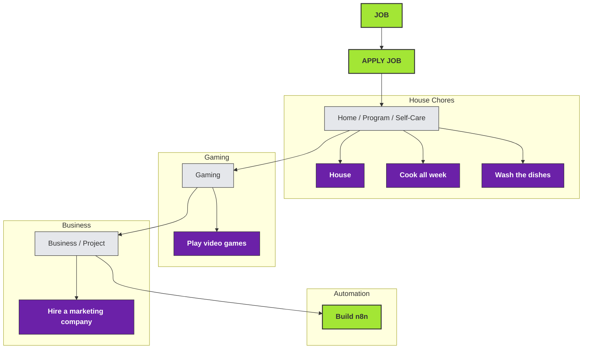

```mermaid
graph TD
    classDef header fill:#A3E635,stroke:#333,stroke-width:2px,font-weight:bold;
    classDef mainJob fill:#E5E7EB,stroke:#333,stroke-width:1px;
    classDef applyJob fill:#6B21A8,color:#fff,stroke:#333,stroke-width:1px,font-weight:bold;

    H1["JOB"]:::header --> H2["APPLY JOB"]:::header

    subgraph SEC1 ["House Chores"]
        Job1["Home / Program / Self-Care"]:::mainJob
        App1_1["House"]:::applyJob
        App1_2["Cook all week"]:::applyJob
        App1_3["Wash the dishes"]:::applyJob
        Job1 --> App1_1
        Job1 --> App1_2
        Job1 --> App1_3
    end

    subgraph SEC2 ["Gaming"]
        Job2["Gaming"]:::mainJob
        App2_1["Play video games"]:::applyJob
        Job2 --> App2_1
    end

    subgraph SEC3 ["Business"]
        Job3["Business / Project"]:::mainJob
        App3_1["Hire a marketing company"]:::applyJob
        Job3 --> App3_1
    end

    subgraph SEC4 ["Automation"]
        Job4["Build n8n"]:::header
    end

    H2 --> Job1
    Job1 --> Job2
    Job2 --> Job3
    Job3 --> Job4

    click Job1 "http://google.com"
    click Job2 "http://youtube.com"
    click Job3 "http://github.com"
    click Job4 "http://wikipedia.org"
```
